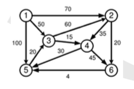

# Derinių ir gretinių taikymas

Visi junginiai skirstomi į derinius ir gretinius. Junginius iš k (1 < k < n) elementų vadiname deriniais, jeigu elementai junginyje nesikartoja ir elementų išdėstymo tvarka nėra svarbi, t.y. sukeitę elementus vietomis, gauname tą patį junginį. Derinių skaičių žymime $$C_n^k$$ ir randame pagal formulę

$$
C_n^k = \frac{n!}{k!(n-k)!}
$$

Pavyzdžiui, jeigu turime 5 skirtingus patiekalus, tai pietų meniu iš 3 patiekalų galime sudaryti $$C_5^3 = 10$$ būdų.

Junginius iš k (1 < k < n) elementų vadiname gretiniais, jeigu elementai junginyje nesikartoja ir elementų išdėstymo tvarka yra svarbi, t.y. sukeitę elementus vietomis, gauname naują junginį. Gretutinių skaičių žymime $$A_n^k$$ ir randame pagal formulę:

$$
A_n^k = \frac{n!}{(n-k)!}
$$

Pavyzdžiui, jeigu turime 6 rūšių augalų sėklas ir reikia skirtingais augalais apželdinti 3 gretimas aikšteles, tai galime padaryti $$A_6^3 = 6 * 5 * 4 = 120$$ būdų.

Jeigu k = n, tai tokie gretiniai skiriasi tik elementų išdėstymo tvarka, jie vadinami kėliniais. Kėlinių skaičių žymime $$P_n$$ ir randame pagal formulę

$$
P_n = A_n^k = n!
$$

Priminsime, kad 0! = 1.

# Kombinatorinių objektų generavimo bendroji schema

Bendroji algoritmų schema, dažniausiai naudojama generuoti kombinatorinius objektus:

    GenerateCombinatorialObjects()
    begin
    (1)    ok = InitObject(P)
    (2)    while ( ok == true ) do
    (3)        P.Update();
    (4)        ok = P.GenerateNext();
           end do
    end GenerateCombinatorialObjects

Realizuodami konkretų algoritmą, turime nurodyti, kaip inicializuojame pradinį objektą P, bei sukurti algoritmą, generuojantį naują objektą, gretimą turimam. jeigu visi junginiai jau peržiūrėti, tai funkcija grąžina kintamojo reikšmę ``ok = false``.
Funkcija ``P.Update()`` vykdo taikomosios programos skaičiavimus, paprasčiausiu atveju galima išspausdinti šį junginį. Jeigu objektų generavimo tvarka yra nesvarbi, tai funkcija ``P.GenerateNext()`` išrenka bet kurį dar nenaudotą objektą.

# Derinių generavimo algoritmai ir skirtumai tarp jų

## Leksikografine tvarka

* Padinio derinio inicializavimas. Pradinį $$C_n^k$$ derinį sudaro ``k``mažiausių aibės ``A``elementų -- ``(1, 2, ..., N)``
* Gretimo derinio skaičiavimas. Tarkime, kad turime derinį ``(i_1, i_2, ..., i_k)``, tada gretimą derinį, didesnį už duotąjį skaičiuojame tokiu algoritmu:
    * Randame pirmą iš dešinės elementą $$i_j$$, tenkinantį sąlygą $$i_j < (n-k+j)$$. Čia įvertiname tai, kad didžiausias derinys yra $$(n-k+1, n-k+2, ..., n)$$, todėl visiems deriniams turi būti išpildyta sąlyga   
$$
i_l < (n-k+l), l = 1, ..., k
$$
    * Imame didesnį aibės ``A``elementą ``i_j := i_j + 1``, o likusius derinio elementus užpildome gretimais ``A`` elementais.
* Generavimo pabaigos požymio nustatymas. Jeigu ``i_1 = n - k + 1``, tai reiškia, kad jau suradome visus derinius. Algoritme šią sąlygą realizuojame naudodami pagalbinį nulinį derinio kraštinį elementą.

Derinių generavimas leksikografine tvarka
$$
C_5^3
$$

Aibė ``A`` turi penkis elementus ``A = {1, 3, 5, 7, 9}``. Paskutinis (didžiausias) derinys yra (5, 7, 9). Šia informaciją naudojame ieškodami naujo derinio, gretimojo radimui. Gauname tokią derinių seką:

    (1, 3, 5), (1, 3, 7), (1, 3, 9), (1, 5, 7), (1, 5, 9),
    (1, 7, 9), (3, 5, 7), (3, 5, 9), (3, 7, 9), (5, 7, 9).

## Minimalių pokyčių tvarka

Sudaroma tokia derinių seka, kai vienas šios sekos narys yra gaunamas iš prieš jį stovinčio derinio, pakeitus jame vieną elementą kitu. Taip generuoti derinius yra sudėtingiau, nei leksikografine didėjimo tvarka.
Panašiai kaip ir aibės poaibių generavimo algoritme naudosime Grėjaus sekas. Kiekvieną derinį užrašysime dvejetainiu kodu ``(b_1, b_2, ..., b_n)``, čia $$b_j=1$$, jeigu j-tasis aibės ``A`` elementas priklauso deriniui ir $$b_j=0$$ priešingu atveju. $$C_n^k$$ derinių dvejetainiuose koduose yra po ``k`` vienetų ir ``(n-k)`` nulių.
Minimalaus pokyčio tvarka generuotoje sekoje dviejų gretimų darinių koduose skiriasi tik du bitai, vienam nulis keičiamas vienetu, kitam -- vienetas keičiamas nuliu. Pavyzdžiui, du gretimi kodai

    (0, 0, 1, 0, 1, 1),
    (1, 0, 0, 0, 1, 1),
    
Generuoja $$C_6^3$$ derinius ``(3, 5, 6)`` ir ``(1, 5, 6)``.

Pažymėkime ``n``bitų ilgio Grėjaus seką ``G(n)``, tą pačią seką, užrašytą atvirkščia tvarka, žymėsime ``G^R(n)``, o Grėjaus posekį, sudarytą iš ``k`` vienetų ir ``(n-k)`` nulių, pažymėkime ``G(n, k)``.

Derinių generavimas minimalių pokyčių tvarka 
$$
C_5^3
$$

Sudarome Grėjaus seką ``G(4)``, ``#``  išskirti posekio ``G(4,2)`` elementai

    p = 0  (0, 0, 0, 0),
    p = 1  (0, 0, 0, 1),
    p = 2  (0, 0, 1, 1), #
    p = 3  (0, 0, 1, 0),
    p = 4  (0, 1, 1, 0), #
    p = 5  (0, 1, 1, 1),
    p = 6  (0, 1, 0, 1), #
    p = 7  (0, 1, 0, 0),
    p = 8  (1, 1, 0, 0), # 
    p = 9  (1, 1, 0, 1), 
    p = 10 (1, 1, 1, 1),
    p = 11 (1, 1, 1, 0), 
    p = 12 (1, 0, 1, 0), #
    p = 13 (1, 0, 1, 1),
    p = 14 (1, 0, 0, 1), #
    p = 15 (1, 0, 0, 0)

Imkime raidžių aibę ``A={a, b, c, d}``, tuomet naudodami seką ``G(4, 2)`` minimalių pokyčių tvarka generuojame visus derinius po dvi raides

    (c, d), (b, c), (b, d), (a, b), (a, c), (a, d).

# Kėlinių generavimo algoritmai ir skirtumai tarp jų

## Leksikografine didėjimo tvarka

Kėlinių generavimo algoritmams naudosime baigtinę objektų aibę ``A``, turinčia ``n``elementų

$$
A = {a_1, a_2, ..., a_n}
$$

Iš aibės ``A`` elementų sudarytus kėlinius galime palyginti sąryšio atžvilgiu

\\[
(a_{i1}, a_{i2}, ..., a_{in}) \prec (a_{j1}, a_{j2}, ..., a_{jn})
\\]

Sudaromi pagrindiniai bendrosios schemos algoritmai:

* Pradinio kėlimo inicializavimas. Pradinį ``Pn`` kėlinį sudaro aibės ``A`` elementai, išdėstyti didėjimo tvarka ``(1, 2, ..., n)``
* Gretimo kėlinio skaičiavimas. Tarkime turime kėlinį ``(p_1, p_2, ..., p_n)``, tada gretimą kėlinį, didesnį už duotąjį, skaičiuojame tokiu algoritmu:
    * Randame pirmą iš dešinės porą, tenkinančią sąlygą ``p_i < p_{i+1}``
    * Tarp elementų $${p_{i+1}, ..., p_n}$$ randame mažiausią elementą, didesnį už ``p_i``:
$$
    p_j = \min(p_k : p_k > p_i)
$$
    * Elementus $$p_i$$ ir $$p_j$$ sukeičiame vietomis
    * Elementus $${p_{i+1}, ..., p_n}$$ išdėstome atvirkščia tvarka
    
Generavimo pabaigos požymio nustatymas. Jeigu i=0, tai reiškia, kad jau suradome visus kėlinius. Algoritme šią sąlygą realizuojame naudodami pagalbinį nulinį kėlimo barjerinį elementą.
Kaip pavyzdį, imkime kėlinį ``(3, 7, 5, 8, 6, 4, 2, 1)`` ir generuokime gretimą didesnį kėlinį. Pirmame cikle randame pirmąjį iš dešinės didėjančių skaičių porą ``(5, 8)``. Mažiausias skaičius didesnis už ``5`` yra ``6``, šiuos skaičius sukeičiame vietomis, gauname junginį ``(3, 7, 6, 8, 5, 4, 2, 1)``. Tada visus skaičius po 6 užrašome atvirkščia tvarka ir gauname naują kėlinį ``(3, 7, 6, 1, 2, 4, 5, 8)``.

Nelygybė 

$$
(p_1, p_2, ..., p_n) \prec (\pi_1, \pi_2, ..., \pi_n)
$$

tik tada ir tik tada, kai

$$
p_l = \pi_l, l = 1, ..., k - 1, p_k < \pi_k
$$

Akivaizdu, kad pradinis kėlinys ``(1, 2, ..., n)`` yra mažiausias kėlinys. Tarkime, kad algoritmas tęsi ``(pi_1, pi_2, ..., p_n)`` kėlinių seką iki ``(p_1, p_2, ..., p_n)``. Įrodysime, kad naujas kėlinys yra mažiausias kėlinys, didesnis už ``(p_1, p_2, ..., p_n)``. Šis kėlinys yra didesni, nes 

$$
p_l = \pi_l, l = 1, ..., i-1, p_i < \pi_i = p_j
$$

Mažesnio kėlinio sudaryti negalėjome, nes tarp visų skaičių $$(p_{i+1}, ..., p_n)$$ naudotoji reikšmė ``\pi_i = p_j`` yra mažiausias skaičius, didesnis už ``p_i``. Jeigu parinktume skaičių, mažesnį už ``p_i``, tai gautume mažesnį kėlinį, o ne didesnį.

## Minimalių pokyčių tvarka

Sudarome tokią kėlinių seką, kai kiekvienas šios sekos narys gaunamas iš prieš jį stovinčio kėlinio, sukeitus du gretimus elementus vietomis.
Metodo idėja labai paprasta, ji grindžiama matematine indukcija. Pradedame nuo sekos sudarymo, kai ``k=1``, tada ``P_1`` turi tik vieną elementą ``(1)``. Tarkime, kad jau generavome kėlinių seką ``P_{n-1}``:

$$
P_{n-1} = { \Pi_1, \Pi_2, ..., \Pi(n-1)! }
$$

Tada kėlinių seką ``P_n`` generuojame tokiu būdu: iš eilės imame sekos ``P_{n-1}`` elementus ``\Pi_i`` ir į visas galimas pozicijas įterpiame ``n``. Jei ``i``yra nelyginis, tai šį procesą vykdome iš dešinės į kairę, jei ``i`` yra lyginis, tai iš kairės į dešinę.

Pradedame nuo sekos ``P_1 = {(1)}``. Tada generuojame kėlinių seką

$$
P_2 = {(1, 2), (2, 1)}
$$

Dabar galime sudaryti kėlinių seką ``P_3``. Į kėlinį ``\Pi_1 = (1, 2)`` įterpiame naują skaičių ``3`` iš dešinės į kairę, o kėlinį ``\Pi_2 = (2,1)`` -- iš kairės į dešinę

$$
P_3 = {(1,2,3), (1,3,2), (3, 1, 2), (3, 2, 1), (2, 3, 1), (2, 1, 3)}
$$

Gretimi kėliniai gaunami sukeitus du gretimus elementus vietomis.

# Kombinatoriniai skaičių teorijos algoritmai ir skirtumai tarp jų

Skaičių teorijoje yra daug kombinatorinių uždavinių apie skaičių sekų, turinčių įvairias savybes, generavimą. Taip pat skaičių išdėstymą į specialias sandaugas ar sumas. Jie naudojami informacijai koduoti ir šifruoti.
Natūralusis skaičius, didesnis nei 1, kuris dalijamas tik iš savęs ir vieneto, yra pirminis skaičius. Vienetas nelaikomas nei pirminiu, nei sudėtiniu. Mažiausi pirminiai skaičiai: 2, 3, 5, 7, 11, 13.
Nesunku įrodyti, kad pirminių skaičių yra be galo daug. Skaičių teorijoje įrodyta daug teiginių apie pirminių skaičių pasiskirstymą.
Pažymėkime $$\pi(x)$$ funkciją, parodančią kiek yra pirminių skaičių, ne didesnių už ``x``, tuomet ``pi(13) = 6``.
Yra įrodyta, kad 

$$
\pi(x) \approx \frac{x}{ln x}, x \rightarrow \infty
$$

Tikslesnį ``pi(x)`` asimptotinį įvertį gauname naudodamiesi teiginiu, kad tikimybė, jog atsitiktinai pasirinktas skaičius ``x`` pirminis, yra lygi 

$$\frac{1}{ln(x)}$$
$$\pi(x) \approx \int_2^x\frac{1}{ln(t)}dt$$

Iš apibrėžimo gauname pirmąjį pirminių skaičių radimo algoritmą: tikriname, ar skaičius n dalijasi iš kurio nors natūraliojo skaičiaus, mažesnio už jį patį, jeigu tokių skaičių nerandame, tai ``n`` yra pirminis.

    GeneratePrime2(N)
    begin
        for (n =2; n <= N; n++) do
            ok = true, i = 2;
            while (i <= |\sqrt{n}| && ok == true) do
                if (n % i == 0) ok = false;
                i := i + 1;
            end do
            if (ok == true) then
                Print(n);
            end if
        end do
    end GeneratePrime2

Algoritmą galime dar patobulinti, pažymėję, kad jei skaičius ``n`` nėra pirminis, tai jį galime vieninteliu būdu išskaidyti į pirminių skaičių sandaugą

$$
n = p_1p_2\bullet\bullet\bullet p_k, p_1 < p_2 < \bullet\bullet\bullet < p_k
$$

Todėl užtenka patikrinti, ar ``n`` dalinasi iš kokio nors pirminio skaičiaus, ne didesnio už 
$$
\sqrt{N}
$$

Šiuos skaičius saugome masyve ``P``.

    GeneratePrime3(N)
    begin
        GeneratePrime2(|\sqrt(N)|);
        for (n=2; n <= N; n++) do
            ok = true, i = 1;
            while (i <= pi(|\sqrt(N)|) && P(i) <= |\sqrt{n}| && ok == true) do
                if (n % i == 0) ok = false;
                i := i + 1;
            end do
            if (ok == true) then
                Print(n);
            end if
        end do
    end GenereatePrime3
    
## Rėčio algoritmas

Šiame algoritme nereikia atlikti dalybos veiksmų, nors kaip tik šis veiksmas naudojamas pirminių skaičių apibrėžime. Rėčio algoritme visus natūraliuosius skaičius iki ``n``surašome į masyvą. paskui imame mažiausią pirminį skaičių 2 ir visus jo kartotinius ``m = 2k`` pažymėkime kaip sudėtinius skaičius. Pirmasis nepažymėtas skaičius (mūsų atveju 3) yra pirminis, tada pašaliname visos jo kartotinius, t.y. skaičius ``m=3k``. Šį procesą kartojame su visais pirminiais skaičiais, ne didesniais už ``\sqrt{n}``. Toks procesas tikrai panašus į sijojimą su rėčio, tik šiame algoritme išsijojame nereikalingus kartotinius skaičius ``2k``, ``3k``, ``5k``, ...

## Laimingi skaičiai

Tai sudėtingesnis rėčio algoritmo atvejis, kai generuojami laimingi skaičiai, likę natūraliųjų skaičių aibėje pašalinus kas antrą skaičių, paskui iš likusios aibės kas n-tajį skaičių, čia n gautas laimingas skaičius. Skaičiai, kurie lieka nepašalinti, ir yra laimingi.
Pradedame nuo pirmojo laimingo skaičiaus -- vieneto. 
Tada pašaliname kas antrą skaičių, gauname nelyginių skaičių seką: ``1, 3, 5, 7, 9, ...``
Tada šaliname kas trečią likusį skaičių: ``1, 3, 7, 9, 13, 15, 19, 21, ...``
Trečiuoju žingsnių pašaliname kas septintą skaičių: ``1, 3, 7, 9, 13, 15, 21, 25, ...``

Laimingų skaičių pasiskirstymo dėsniai panašūs į atitinkamus pirminių skaičių dėsnius, pavyzdžiui, tikimybę, kad skaičius ``n`` yra laimingas, asimptotiškai lygi 

$$
\frac{1}{ln(n)}
$$

Laimingų skaičių generavimo rėčio algoritmą realizuoti sudėtingiau, nes skaičiaus likimas priklauso ne nuo jo pradinės padėties, bet nuo likusių elementų skaičiaus. Todėl tenka papildomai skaičiuoti sekos elementus arba seką saugoti tiesiniame sąraše.

# Grafai ir jų vaizdavimas

Yra sunku parinkti duomenų struktūra. Būtina atsižvelgti į du kriterijus:

* Saugomos informacijos apimtį
* Veiksmų su grafais atlikimo efektyvumą

Ypač dažnai reikia rasti viršūnes, kurios yra gretimos duotajai. Dažniausiai grafo struktūrą apibrėžiame naudodami tiesines algebros duomenų struktūrą -- matricas. Kadangi matricos yra įvairių tipų, galime prisitaikyti prie grafo briaunų pasiskirstymo ir jų kiekio.

Išnagrinėsime 2 svarbius atvejus:

* Kai grafas yra artimas pilnajam
* Kai kiekviena viršūnė sujungta tik su nedideliu skaičiumi kaimyninių viršūnių.

Grafo viršūnių gretimumo matrica

* Turime grafą ``G = (V, E)``, kurį apibrėžiama ``n*n`` dydžio matrica
\\[
S = \begin{bmatrix} 
S_{11} & S_{12} & \dots & S_{1n} \\
S_{21} & S_{22} & \dots & S_{2n} \\
\dots & \dots & \dots & \dots \\
S_{n1} & S_{n2} & \dots & S_{nn} \\
\end{bmatrix}
\\]
* Jos elementai yra tokie
\\[
S_{ij} = \left\{ \begin{array}{ll} 
    1, e_{ij} = (v_i, v_j) \in E \\
    0, e_{ij} \notin E
\end{array} \right .
\\]
* Jei grafas yra svertinis, tai gretimumo matricoje saugome ir brianų svorius
\\[
S_{ij} = \left\{ \begin{array}{ll} 
    w_{ij}, e_{ij} \in E \\
    0, e_{ij} \notin E
\end{array} \right .
\\]
* Jei grafas nėra orientuotasis, tai jo gretimumo matrica ``S``yra simetrinė
\\[
S_{ij} = S_{ji}, 1 < i, j < n
\\]
* Matricos ``S`` i-tosios eilutės nenuliniai elementai apibrėžia tas viršūnes $$v_j$$, į kurias galima pateikti iš ``v_i`` viršūnės.
* Atitinkamai, j-ojo stulpelio nenuliniai elementai apibrėžia viršūnes $$v_i$$, iš kurių galima patekti į ``v_j``.
* Saugomos informacijos apimtis yra $$n^2$$ skaičių, viršūnės $$v_i$$ visas gretimas viršūnes randame, atlikę ``n`` veiksmų.
* Šį duomenų struktūra ypač efektyvi, kai reikia parinkti ar $$e_{ij} \in E$$, tokio veiksmo sąnaudos yra ``O(1)`` eilės dydis

Suspausto formato matrica

* Dažniausiai grafo viršūnių laipsnis (gretimų viršūnių skaičius) yra daug mažesnis už ``n``.
* Todėl didesnioji grafo viršūnių gretimumo matricos koeficientų dalis yra nuliai ir toks informacijos saugojimo būdas nėra ekonomiškas
* Tiesinėje algebroje matricas, kurių eilučių nenulinių koeficientų skaičius yra daug mažesnis už stulpelių skaičių, vadiname retomis
* Joms saugoti taikome įvairius informacijos suspaudimo būdus
* Masyve ``A`` iš eilės surašome visų viršūnių gretimas viršūnes
* Šio masyvo ilgis lygus grafo briaunų skaičiui ``E``
* Masyvo ``R`` elementas ir, nurodo viršūnės ``v_i`` gretimų viršūnių sąrašo pradžią masyve ``A``, taigi ``v_i`` kaimynų aibę apibrėžiame $$N(v_i) = { v_{aj} : r_i <= j < r_{i+1}}$$
* Masyvo ``R`` ilgis yra (n+1), paskutinį elementą $$r_{n+1} = |E| +1$$ naudojame apibrėžiami ``v_n`` kaimynus
* Jeigu turime įvertinti grafą ``G``, tai masyve ``W`` saugome atitinkamų briaunų svorius
* Briaunos numeruojamos taip pat, kaip ir gretimos viršūnės ``A`` masyve
* Pirmojo grafo viršūnių gretimumo matrica
\\[
A_1 = (2, 3, 4, 1, 5, 1, 4, 6, 1, 3, 5, 2, 4, 3) \\
R_1 = (1, 4, 6, 9, 12, 14, 15, 15)
\\]
* Paskutinė viršūnė ``v_7`` yra izoliuota, todėl jos kaimynų aibė
\\[
N(v_7) = { v_{aj} : 15 < j < 15 }
\\]
* Antrojo ir trečiojo grafų viršūnių gretimumo matricos
\\[
A_2 = (2, 1, 1, 4, 2, 3), \\
R_2 = (1, 2, 3, 5, 7), \\
A_3 = (2, 3, 4, 1, 6, 1, 4, 5, 1, 3, 5, 6, 3, 4, 2, 4), \\
W_2 = (1, 1, 3, 1, 5, 1, 2, 2, 3, 2, 4, 3, 2, 4, 5, 3), \\
R_3 = (1, 4, 6, 9, 13, 15, 17),
\\]

# Trumpiausio kelio radimo algoritmai

## Dijkstros algoritmas

Pirmiausia spręsime 2 uždavinį -- rasime trumpiausius kelius nuo viršūnės ``v``iki visų kitų įvertintojo grafo viršūnių $$w \in V$$. Masyve ``D`` saugome trumpiausių kelių iki kiekvienos viršūnės ilgius, masyvą ``P``panaudojame maršrutui optimaliai atstatyti, o ``i``-tojo elemento reikšmė $$p_i = k$$ parodo, kad į $$v_i$$ viršūnę patenkame iš $$v_k$$ viršūnės.

Tegul ``S``yra aibė viršūnių, iki kurių jau radome trumpiausią kelią. Pradžioje šiai aibei priklauso tik pradinė viršūnė ``v``. Vykdydami algoritmą kiekviename žingsnyje aibę ``S`` papildome nauja viršūne.

Aibėje ``Q`` saugome viršūnes, iki kurių trumpiausias kelias dar nežinomas. Taupydami kompiuterio atmintį, galime apsiriboti tik aibe ``S``arba ``Q``, kadangi $$ Q = \frac{V}{S}$$, tačiau algoritmo realizacija yra efektyvesnė, kai parenkame tinkamą duomenų struktūrą aibei ``Q`` saugoti. Tarsime, kad pradinė yra $$v_1$$ viršūnė.

Vykdydami pirmąjį algoritmo žingsnį, randame viršūnę $$w_1$$, iki kurios kelias iš $$v_1$$ yra trumpiausias. Paskui nagrinėjame visas naujosios viršūnės dar neperrinktas kaimynes $$v_j$$ ir lyginame dviejų kelių ilgius: Geriausio iš iki šiol žinomų ir naujo kelio, kai pirmiausia trumpiausiu keliu einame į $$w_1$$, o iš jos pasiekiame $$v_j$$. Šį algoritmą kartojame ir kituos žingsniuose. 

Dijkstros algoritme naudojame godžiojo metodo principą -- kiekvienu žingsniu pasirenkame geriausią lokalų sprendinį. Godusis algoritmas nebūtinai garantuoja gautojo sprendinio globalų optimalumą.

Pavyzdys

Rasime trumpiausius kelius iš viršūnės $$v_1$$ iki visų likusių grafo viršūnių. Aibė ``S`` ir masyvų ``D``, ``P`` pradinė reikšmės yra tokios

\\[
i = 0: S = {v_1} \\
D = (0, 70, 40, \infty, 100, \infty), P = ( 1,1,1,1,1,1)
\\]

Algoritmo vykdymo eiga yra tokia

\\[
i = 1 : S = {v_1, v_3}, D = (0, 70, 50, 65, 100, \infty), P = (1,1,1,3,1,1)
i = 2 : S = {v_1, v_3, v_4}, D = (0, 70, 50, 65, 95, 110), P = (1,1,1,3,4,4)
i = 3 : S = {v_1, v_3, v_4, v_2}, D = (0, 70, 50, 65, 95, 90), P = (1,1,1,3,4,2)
i = 4 : S = {v_1, v_3, v_4, v_2, v_6}, D = (0, 70, 50, 65, 94, 90), P = (1,1,1,3,6,2)
i = 5 : S = {v_1, v_3, v_4, v_2, v_6, v_5}, D = (0, 70, 50, 65, 94, 90), P = (1,1,1,3,6,2)
\\]

Tada trumpiausias kelias, jungiantis $$v_1$$ ir $$v_5$$ yra $$p=(v_1, v_2, v_6, v_5)$$, o jo ilgis  $$|p| = 94$$. Jeigu būtų reikėję rasti trumpiausią kelią iki $$v_4$$ viršūnės, tai algoritmas būtų baigtas po antrojo žingsnio, o $$p=(v_1, v_3, v_4)$$.

Sudėtingumas. Vykdant Dijkstros algoritmą, ciklą kartojame $$(|V| - 1)$$ kartą. Kiekvienu žingsniu randame aibės $$Q$$ viršūnę, iki kurios kelio ilgis trumpiausias. Šios operacijos sudėtingumas priklauso nuo duomenų struktūros, realizuojančios aibę $$Q$$. Jeigu naudojame masyvą, tai veiksmų skaičius $$O(|Q|)$$, todėl trumpiausių kelių ilgių paieška iš viso reikalauja $$O(|V|^2)$$ veiksmų. Kiekvieno grafo briauna analizuojama tik vieną kartą, todėl kelių ilgiai perskaičiuojami $$|E|$$ kartų, ir atliekame $$O(|E|)$$ veiksmų.

Dijkstors algoritmo skaičiavimų apimtis yra $$O(|V|^2)$$ veiksmų.

## Didžiausios keliamos galio kelio radimas

Tai dar vienas iš uždavinių, kuri turime įvertintąjį grafą $$G = (V, E)$$, kurio briaunų įverčiai rodo didžiausią krovinio svorį, kurį galima vežti šia atkarpa. Reikia rasti kelius, jungiančius duotąją grafo viršūnę $$v \in V$$ su kitomis viršūnėmis $$w \in V$$, kad leistinas vežamų krovinių svoris būdų didžiausias. Uždavinio sprendimo algoritmą gauname modifikuodami Dijkstro algoritmą. Trumpiausias kelias, jungiantis $$v$$ su $$w$$, kurį galima uždaryti 

\\[
|p_{min}| = min_{p} \sum_{j=0}^{m(p) - 1} |e_{j,j+1}|
\\]

Tada dažniausios keliamosios galios kelio radimo uždavinį užrašome taip

\\[
|p_{max}| = max_{p} min_{0 < j < m(p) -1} |e_{j,j+1}|
\\]

## Floido algoritmas

Spręsdami 4 uždavinį, kai reikia rasti trumpiausius kelius tarp visų įvertintojo grafo G viršūnių porų. Šį uždavinį galime spręsti Dijkstros algoritmu, kurį kartojame ``n`` kartų su vis kita pradine viršūne. Tokio metodo skaičiavimų apimtis yra 

\\[
O (|V|^2 log|V| + |V||E|)
\\]

Vietoje godžiojo metodo taikysime dinaminio programavimo metodą. Tada reikia užrašyti variacinę sąlygą, susiejančią viso uždavinio spręndinį su mažesnių uždavinių optimaliais sprendiniais.

Pažymėkime $$D_k$$ matricą, kurios koeficientai $$d_{ij}(k)$$ apibrėžia ilgų trumpiausio kelio nuo viršūnės $$v_i$$ iki viršūnės $$v_j$$, kuriame nėra tarpinių viršūnių, kurių indeksai didesni už $$k$$.

# Minimalus dengiantysis medis ir jo radimo algoritmai

Oh god

# Specialieji grafų algoritmai

# Didžiausio srauto radimo tinkluose algoritmai

# Keliaujančio pirklio uždavinys

# Daugianario reikšmės apskaičiavimo būdai

Reikia apskaičiuoti daugianario

$$
p(x) = a_0 x^n + a_1x^{n-1} + a_2 x^{n-2} + ... + a_{n-1}x + a_n
$$

Reikšmę taške ``x``, kai žinomos koeficientų ``a`` reikšmės

    float DaugianarioReiksme (double x)
    begin
    (1) pX=A(n), xN=1;
    (2) for (j=n-1; j>=0; j--) do
    (3)   xN=xN*x;
    (4)   pX=pX+A(j)*xN;
        end
    (5) return(pX);
    
Vykdydami pateiktą algoritmą atliekame ``2n`` daugybos ir ``n`` sumavimo veiksmų.

Daugianario reikšmę apskaičiuojame efektyviau naudodami Hornerio skaičiavimo schemą.

    float HornerioSchema (double x)
    begin
    (1) pX=A(0);
    (2) for (j=1; j<=n; j++) do
    (3)   pX=pX*x+A(j);
        end
    (5) return(pX);
    
Vykdydami Hornerio algoritmą, atliekame ``n`` daugybos ir ``n``sumavimo veiksmų, t.y. daugybos veiksmų skaičius sumažėjo perpus.

Taikydami skaldyk ir valdyk metodiką, gauname dar efektyvesni algoritmą.

* Skaičiuokime daugianario $$x^{256}$$ reikšmę
* Hornerio algoritmu teks atlikti 255 daugybos veiksmus

~~~~
    float FastPolynom (double x)
    begin
    (1) pX=x*x;
    (2) for (j=1; j<=2; j++) do
    (3)   pX=pX*pX;
        end do
    (4) return(pX)
    end HornerioSchema
~~~~
    
Paskutiniame algoritme rezultatas gaunamas atlikus 3 daugybos veiksmus. 

Nagrinėkime daugianarį, kurio laipsnis $$n = 2^k-1, k > 1$$, o koeficientas, esant didžiausiam laipsniui, lygus vienetui

\\[
p_n(x) = x^n + a_1 x^{x-1} + a_2 x^{n-2} + ... + a_{n-1}x +a_n \\
p_n(x) = (x^m + b) q(x) + r(x), m = 2^{k-1}
\\]

Čia $$q_j(x)$$, $$r_j(x)$$ yra tokio pačio tipo, bet žemesnio laipsnio $$j=2^{k-1}-1$$, daugianariai

\\[
q_j(x) = x^j + c_1x^{j-1} + c_2x^{j-2} + ... + c_{j-1}x + c_j \\
r_j(x) = x^j + d_1x^{j-1} + d_2x^{j-2} + ... + d_{j-1}x + d_j
\\]

Todėl ir jiems galima taikyti tokį patį algoritmą.

Naujuoju algoritmu daugianario reikšmę apskaičiuojame atlikę $$\frac{n}{2}$$ daugybos ir $$\frac{3n}{2}$$ sumavimo veiksmų.

Daugianario reikšmės skaičiavimo pavyzdys. Pirmiausiai turime apskaičiuoti pagalbinių žemesniosios eilės daugianarių koeficientus. Imkime septintosios eilės daugianarį

\\[
p_7(x) = x^7 + 3x^6 + 2x^5 + 13x^4 - x^3 + 9x^2 - 2x - 32
\\]

Kadangi $$7=2^3-1$$, tai $$m=4$$ ir gauname daugiklį $$(x^4+b)$$. Rasime tokią konstantą ``b``, kad abiejų daugianarių $$q_3(x)$$ ir $$r_3(x)$$ koeficientai, esant didžiausio laipsnio nariui, būtų lygus vienetui, t.y. galiotų lygybė

\\[
p_7(x) = (x^4 + b)(x^3 + q_2(x) + x^3 +r_2(x))
\\]

Palyginę koeficientus, kai $$x^3$$, gauname lygtį $$b + 1 = -1$$ arba $$b = -2$$. Taigi ieškome daugianarių $$q_3(x)$$ ir $$r_3(x)$$, tenkinančią lygybę

\\[
p_7(x) = (x^4 - 2)q_3(x) + r_3(x)
\\]

Juos randame $$p_7(x)$$ dalindami iš $$(x^4 - 2)$$

\\[
p_7(x) = (x^4 - 2)(x^3 + 3x^2 + 2x + 13) + (x^3 + 15x^2 + 2x - 6)
\\]

Kitu etapu panašiai išskaidome daugianarius $$q_3(x)$$ ir $$r_3(x)$$

\\[
q_3(x) = (x^2+1)(x+3)+(x+10), \\
r_3(x) = (x^2+1)(x+15)+(x-6)
\\]

Gauname tokį daugianario $$p(x)$$ išskaidymą į paprastesnius daugiklius

\\[
p_7(x) = (x^4-2)((x^2+1)(x+3)+(x+10))((x^2+1)(x+15)+(x-6))
\\]

# Matricų veiksmai

Turime $$n*m$$ ir $$m*k$$ dydžio matricas ``A`` ir ``B``. Jų sandauga $$C=AB$$ yra $$n*k$$ dydžio matrica

\\[
c_{ij} = \sum_{l=1}^{m} a_{il}b_{lj}
\\]

Vykdydami matricų daugybos algoritmą, atliekame $$nkm$$ daugybos ir $$nk(m-1)$$ sudėties veiksmų. Jeigu visos matricos yra $$n*n$$ dydžio, tai algoritmo sudėtingumas $$2n^3$$ aritmetinių veiksmų.

Matricos daugybos uždaviniui egzistuoja sudėtingesni, bet ir spartesni skaičiavimo algoritmai. Nagrinėkime kvadratinės $$n*n$$ dydžio matricos ``A``, ``B`` ir ``C``, kurias paskirstome į $$m*m$$ dydžio blokines matricas, $$m=\frac{n}{p}$$. Tuomet matricų sandaugą galime išreikšti tokiu algoritmu

\\[
C_{ij} = \sum_{k=1}^p A_{ik}B_{kj}, 1 < i, j < p
\\]

$$m*m$$ dydžio matricų sandaugas $$A_{ik}B_{kj}$$ skaičiuojame pirmuoju algoritmu. Tuomet naujo algoritmo veiksmų skaičius yra toks pat, kaip ir senojo, tik pasikeitė veiksmų atlikimo tvarka. 

Nagrinėkime pavyzdį, kai $$p=2$$, tada matricas išskaidome į $$n/2*n/2$$ dydžio blokus

\\[
\begin{bmatrix}
C_{11} & C_{12} \\
C_{21} & C_{22} \\
\end{bmatrix} =
\begin{bmatrix}
A_{11} & A_{12} \\
A_{21} & A_{22}
\end{bmatrix}
\begin{bmatrix}
B_{11} & B_{12} \\
B_{21} & B_{22}
\end{bmatrix}
\\]

Gauname 4 matricų lygybes

\\[
C_{11} = A_{11}B_{11} + A_{12}B_{21}, C_{12} = A_{11}B_{12} + A_{12}B_{22} \\
C_{21} = A_{21}B_{11} + A_{22}B_{21}, C_{22} = A_{21}B_{12} + A_{22}B_{22}
\\]

Tegul $$n=2^k$$, tada gautąsias aštuonias matricų sandaugas vėl skaičiuojame tokiu pačiu rekursyviuoju algoritmu. Pažymėkime algoritmo aritmetinių veiksmų skaičių $$T(n)$$, šią funkciją randame spręsdami rekursijos lygtį

\\[
T(1) = 1,\\
T(n) = 8T(n/2)+n^2 
\\]

Lygties eilės mažinimo metodu apskaičiuojame tokio uždavinio sprendį

\\[
T(n) = 2n^3 - n^2
\\]

Vėl gavime tokį patį algoritmo sudėtingumo įvertį, kaip ir naudodami klasikinį matricų sandaugos algoritmą.

Štarsenas sukūrė naują rekusyvujį matricos daugybos algoritmą. 

Matricos ``C`` koeficientų skaičiavimo formulėse vietoj 8 daugybų atliekamos tik 7, tačiau papildomai vykdome keturiolika matricų sumavimo veiksmų. Matricų daugybos sudėtingumas $$2n^3$$, o sumavimas $$n^2$$.

Dviejų matricų sandaugos skaičiavimas Štarseno algoritmu. Skaičiuojame sandauga ``A``, ``B``, kai

\\[
A = \begin{bmatrix}
5 & 2 \\
3 & 7
\end{bmatrix},
B = \begin{bmatrix}
2 & 4 \\
1 & 8
\end{bmatrix}
\\]

Pirmiausiai apskaičiuojame pagalbinius koeficientus

\\[
P_1 = (5+7)(2+8) = 120\\
P_2 = (3+7)2 = 20 \\
P_3 = 5(4-8) = -20 \\
P_4 = 7(1-2)=-7 \\
P_5 = (5+2)8 = 56 \\
P_6 = (3-5)(2+4) = -12 \\
P_7 = (2-7)(1+8)= -45 
\\]

Tada skaičiuojame matricos ``C`` koeficientus. Gauname tokį rezultatą

\\[
\begin{bmatrix}
5 & 2 \\
3 & 7 
\end{bmatrix}
\begin{bmatrix}
2 & 4 \\
1 & 8 
\end{bmatrix} = 
\begin{bmatrix}
12 & 36 \\
13 & 68
\end{bmatrix}
\\]

# Greitoji furjė transformacija

Turime ``n``kompleksinių skaičių vektorių

\\[
X = (x_0, x_1, ..., x_{n-1})
\\]

Tuomet diskrečioji Furjė transformacija yra apibrėžiama lygtimis

\\[
f_j = \sum_{k=0}^{n-1} x_k e^{-\frac{2\pi i}{n}jk}, j = 0, 1, ..., n-1
\\]

Ši transformacija naudojama skaitmeniniams signalams analizuoti, vaizdams atpažinti, medicinoje, diferencialinėms lygtims spręsti, telekomunikacijoje ir kitur. DFT yra sudėtingas algoritmas. Skaičiuodami $$f_j$$ atliekame $$O(n)$$ veiksmų.

FFT algoritme taikome skaldyk ir valdyk metodiką. Panagrinėsime atvejį, kai $$n=2^k$$. Tuomet DFT uždavinį dalijame į 2 per pus mažesnius uždavinius. Pirmas uždavinys skaičiuos $${x_0, x_2, ..., x_{n-2}}$$, antras $${x_1, x_3, ..., x_{n-1}}$$ koeficientus.

Kol kas nesumažinome algoritmo sudėtingumo, tik pakeitėme veiksmų atlikimo tvarką. Pasirodo, kad visų sumų skaičiuoti nereikia, nes galioja periodinės lygybės.

Taigi reikia apskaičiuoti dviejų $$n/2$$ ilgio sekų DFT koeficientus -- reikia atlikti skaidymą. Skaidymą kartojame ir skaičiuodami trumpesnių skaičių sekų DFT koeficientus. Gauname rekursyvųjį FFT algoritmą.

Sudėtingumo lygtis

\\[
T(n) = \left\{ \begin{array}{ll} 
2T(n/2)+2n, n> 1, \\
1, n=1
\end{array} \right.
\\]

Lygties sprendinį randame lygties eilės mažinimo metodu

\\[
T(n) = 2^k + 2 \sum_{j=0}^{k-1} 2^j 2^{k-j} = 2^k (1+2k) = 2n log(n) + n
\\]

Taigi, greitosios Furjė transformacijos algoritmo sudėtingumas $$O(n log(n))$$. Pavyzdžiui, skaičiuojant $$2048$$ ilgio vektoriaus DFT koeficientus, tada FFT algoritmas maždaug 100 kartų spartesnis.

# P ir NP sudėtingumo uždaviniai

Susipažinsime su daugelio uždavinių sudėtingumo klasifikacija, kuri padės pasirinkti teisingą jų sprendimo strategiją. Svarbu žinoti, kada galime ieškoti tikslaus uždavinio sprendinio, o kada reikia tenkintis euristiniais algoritmais ir spręsti uždavinį tik apytiksliai. 

## P sudėtingumo uždaviniai

Nagrinėdami uždavinius dažnai jų sudėtingumas būdavo $$O(n^k)$$ veiksmų. Tokius uždavinius vadiname polinominio sudėtingumo ir jų klasę žymime $$P$$.

Polinominio sudėtingumo uždavinius dažnai vadiname praktiškai išsprendžiamais uždaviniais, nes jų sprendimo laikas yra gana trumpas ir taikydami galime ieškoti tikslių sprendinių. Daugianario laipsnis $$k$$ algoritmo sudėtingumo įvertyje turi būti nedidelis, nes net ir $$O(n^10)$$ sudėtingumo algoritmas yra neefektyvus nors kiek didesniam uždaviniui spręsti.

## NP sudėtingumo uždaviniai

Egzistuoja daug svarbių taikomųjų uždavinių, kuriems kol kas sukurti tik eksponentinio $$O(a^n)$$ arba faktorialinio $$O(n!)$$ sudėtingumo algoritmai. Labai svarbu išmanyti tokius uždavinius, nes taikydami juos sprendžiame tik apytiksliai ir naudojame polinominio sudėtingumo euristinius algoritmus (kuprinės užpildymo uždavinys)

Šioje grupėje išskiriame NP uždavinių klasę. 

* Pirma, nagrinėjame tik sprendimo priėmimo uždavinius, kai reikia duoti atsakymą taip arba be į pateiktą klausimą
* Antra, NP klasės uždaviniams nežinome polinominio sudėtingumo sprendimo algoritmų, tačiau atlikę $$O(n^k)$$ veiksmų, galime patikrinti, ar duotasis objektas yra uždavinio sprendinys.

##  NP sudėtingumo uždaviniai

Taigi P klasės uždavinius galime greitai išspręsti, o spręsdami NP klasės uždavinius, mokame tik greitai patikrinti sprendinį. Kiekvienas polinominio sudėtingumo uždavinys priklauso NP klasei, nes, radę sprendinį galime nebetikrinti jo teisingumo. Žinome, kad išspręsti uždavinį yra daug sudėtingiau, nei patikrinti ar turime sprendinį.

Kol kas neįrodyta, kad $$P \neq NP$$, t.y. nežinome nė vieno uždavinio, kurio sprendinio patikrinimo algoritmas yra polinominio sudėtingumo, o patį sprendinį galime rasti tik atlikę eksponentinį skaičių veiksmų.

## NP pilnieji uždaviniai

Uždavinių klasė, kurios savybes smarkiai didina tikimybę, kad hipotezė $$P \neq NP$$ teisinga. Dažnai matematikoje uždavinį transformuojame į kitą, jam ekvivalentų, o šį jau mokame spręsti. Tarp NP sudėtingumo uždavinių apibrėžiame NP pilnųjų uždavinių poaibį, kurį žymėsime NPC. Jam priklauso sudėtingiausi uždaviniai, kurie parenkami taip, kad jei pavyktų sukurti kurio nors šios klasės uždavinio polinominio sudėtingumo sprendimo algoritmą, tai ir bet kurį kitą NP klasės uždavinį galėtume išspręsti atlikę polinominį skaičių veiksmų.

# Lygiagretieji kompiuteriai ir jų algoritmai

Spręsdami daugelį svarbių technikos, informatikos uždavinių, turime atlikti tiek daug skaičiavimų, kad net ir naudodami pačius greičiausius šiuolaikinius kompiuterius negalime laiku rasti atsakymo. Kitų didelių uždavinių ribojamuoju veiksniu gali tapti vieno kompiuterio atminties resursai. Tokiais atvejais padeda lygiagrečiosios skaičiavimo sistemos.

Nuoseklieji kompiuteriai turi tik po vieną skaičiavimo ir valdymo įrenginį. Konstruodami lygiagretųjį kompiuterį, galime naudoti daugiau procesorių. Sudarydami lygiagrečiuosius algoritmus sprendžiame kelis pagrindinius uždavinius, tarp jų svarbiausi -- uždavinio išskaidymas į mažesnes užduotis, jų paskirstymas procesoriams ir duomenų persiuntimas tarp procesorių. Būtent duomenų persiuntimo algoritmai esmingai priklauso nuo kompiuterio atminties architektūros.

Skirsime dvi dideles lygiagrečiųjų kompiuterių grupes:

* Bendros paskirties kompiuterius
* Paskirstytosios atminties kompiuterius

Šis padalijimas yra svarbus ne tik sudarant ir analizuojant lygiagrečiuosius algoritmus, bet ir juos realizuojant kompiuterio programa. Vieni programavimo principai ir priemonės skirti bendrosios atminties kompiuteriams, visai kiti -- paskirstytosios atminties kompiuteriams.

## Bendrosios atminties lygiagretieji kompiuteriai

Visi procesoriai atlieka veiksmus su tam tikrais duomenimis, kuriuos perskaito ir užrašo į jiems skiriamas atminties ląsteles. Bendrosios atminties lygiagretieji kompiuteriai turi tik vieną atminties bloką, ir visi procesoriai gali tiesiogiai pasiekti visas atminties vietas. Bendrosios atminties kompiuteriuose lygiagretusis algoritmas vykdomas daugeliu procesų. Kai skaičiuojamos parengtos vykdyti užduotys, naudojamas bet kuris laisvas procesas, todėl norint sumažinti duomenų kopijavimo sąnaudas, operatyviosios atminties turinys sinchronizuojamas visuose procesoriuose. Dėl to atsiranda papildomų algoritmo vykdymo sąnaudų.

## Paskirstytos atminties lygiagretieji skaičiavimai

Dabar kiekvienas procesorius gali tiesiogiai perskaityti ir įrašyti tik duomenis, esančius jo lokaliojo atmintyje. Jeigu algoritmui vykdyti reikalingi duomenys, saugomi kitame procesoriuje, tai antras procesorius turi nusiųsti pirmajam pranešimą su reikalinga informacija. Duomenų persiuntimu turi pasirūpinti pats programuotojas, nurodydamas, kas, kam ir kada turi siųsti ar gauti pranešimą. Aišku toks duomenų siuntimas tampa ir algoritmo vykdymo sinchronizavimo tašku.

Taigi, duomenų mainai paskirstytosios atminties lygiagrečiuose kompiuteriuose yra sudėtingesni nei bendrosios atminties lygiagrečiuose kompiuteriuose. Tačiau šiuo atveju nesusiduriame su svarbia problema, kuri egzistuoja bendrosios atminties kompiuteriuose, kai keli procesoriai vienu metu bando skaityti arba rašyti į tą pačią atminties vietą. Kadangi visus pakeitimus gali atlikti tik tas procesorius, kurio lokalioje atmintyje saugomi duomenys, tai nesunku kontroliuoti duomenų mainus ir jų eiliškumą.

## Lygiagrečiųjų algoritmų sudarymo etapai

Sudarysime bendrą schemą, kuria remdamiesi galime spręsti visus per paskaitas nagrinėjamus uždavinius.

Sudarydami bet kokį lygiagretųjį algoritmą, pirmiausiai turime išskirti nepriklausomas užduotis, kurias skirtingi procesoriai gali spręsti tuo pačiu metu. Kuo daugiau tokių užduočių, tuo daugiau procesorių galime naudoti uždaviniui spręsti ir tolygiau paskirstyti tarp visų procesorių darbą. Kiekvienos užduoties atlikimas priklauso nuo tam tikrų duomenų, todėl siekiame, kad šiuos duomenis jau turėtų pats procesas, kuriam skirta užduotis. Priešingu atveju papildomą informaciją reikia persiųsti iš kito procesoriaus, o tai gan ilgai trunkantis veiksmas.

Užduotis grupuojame taip, kad procesoriams kuo rečiau reikėtų keistis didesniais informacijos kiekiais. Bet toks užduočių sujungimas reiškia mažesnį jų kiekį. Kompromisinio sprendimo radimas ir daro užduočių sąrašo sudarymą sudėtingu uždaviniu.
