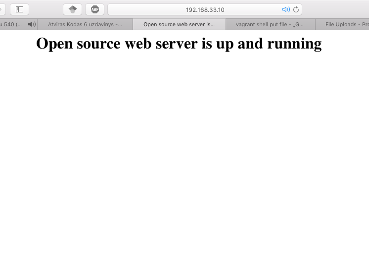

# Atvirojo kodo įranga mokslui, verslui ir valdymui

#### Namų darbas 5, AKSfm-15, Maksim Norkin 

## Užduotis

Įdiegti atviro kodo internetines svetainės serverį. Pagrįskite savo pasirinkimą, pateikti atviro kodo licenciją. Sukonfigūruoti serverį ir pakeisti pradinį puslapį. Patikrinti serverio veikimą.

## Serverio diegimas

Laboratorinio darbo metu darbo palengvinimui bus panaudotas ``vagrant``.

Darbas pradedamas identiškai pirmam laboratoriniam darbui, nuo virtualios mašinos inicijavimo.

    vagrant init https://github.com/kraksoft/vagrant-box-debian/releases/download/7.8.0/debian-7.8.0-amd64.box
    
Toliau reikia aprašyti ką daryti su virtualia mašina, kai jinai jau yra pasikrovus:

    config.vm.provision "shell", inline: <<-SHELL
        # update the package manager
        apt-get update
        # install nginx server
        apt-get install -y nginx
        # let anybody edit this directory (do not do this in real life)
        chmod 777 -R /usr/share/nginx/www/
        # start nginx server
        service nginx start
      SHELL

Buvo pasirinktas ``nginx`` programinis paketas, dėl jo modulių palaikymo bei panašios į BSD licencijos, kuri realiai sako, kad programinę įrangą galima naudoti bet kokiais tikslais ir autoriai nepriima jokios atsakomybės.

    /* 
    * Copyright (C) 2002-2016 Igor Sysoev
    * Copyright (C) 2011-2016 Nginx, Inc.
    * All rights reserved.
    *
    * Redistribution and use in source and binary forms, with or without
    * modification, are permitted provided that the following conditions
    * are met:
    * 1. Redistributions of source code must retain the above copyright
    *    notice, this list of conditions and the following disclaimer.
    * 2. Redistributions in binary form must reproduce the above copyright
    *    notice, this list of conditions and the following disclaimer in the
    *    documentation and/or other materials provided with the distribution.
    *
    * THIS SOFTWARE IS PROVIDED BY THE AUTHOR AND CONTRIBUTORS ``AS IS'' AND
    * ANY EXPRESS OR IMPLIED WARRANTIES, INCLUDING, BUT NOT LIMITED TO, THE
    * IMPLIED WARRANTIES OF MERCHANTABILITY AND FITNESS FOR A PARTICULAR PURPOSE
    * ARE DISCLAIMED.  IN NO EVENT SHALL THE AUTHOR OR CONTRIBUTORS BE LIABLE
    * FOR ANY DIRECT, INDIRECT, INCIDENTAL, SPECIAL, EXEMPLARY, OR CONSEQUENTIAL
    * DAMAGES (INCLUDING, BUT NOT LIMITED TO, PROCUREMENT OF SUBSTITUTE GOODS
    * OR SERVICES; LOSS OF USE, DATA, OR PROFITS; OR BUSINESS INTERRUPTION)
    * HOWEVER CAUSED AND ON ANY THEORY OF LIABILITY, WHETHER IN CONTRACT, STRICT
    * LIABILITY, OR TORT (INCLUDING NEGLIGENCE OR OTHERWISE) ARISING IN ANY WAY
    * OUT OF THE USE OF THIS SOFTWARE, EVEN IF ADVISED OF THE POSSIBILITY OF
    * SUCH DAMAGE.
    */

Sekantis žingsnis yra pagrindinio puslapio keitimas. Sukuriam gražų pradinį puslapį ir patalpinam jį pradiniam kataloge

    <html>
    <head>
    <title>Open source web server is up and running</title>
    </head>
    <body bgcolor="white" text="black">
    

        <h1>Open source web server is up and running</h1>
    

    </body>
    </html>
    
Į virtualią mašiną puslapį patalpinam panaudojus tą patį ``vagrant``

    config.vm.provision "file", 
        source: "index.html", 
        destination: "/usr/share/nginx/www/index.html"
        
Tokiu būdu, paleidus virtualią mašiną, gaunamas rezultatas

## Išvados

Namų darbo metu buvo sukurta virtuali mašina ir paleistas http protokolo serveris, kurio pagalba iš serverio galima pateikti naudotojui turinį. Serverio sprendimas pasirinktas ``nginx`` [1], dėl licencijos yra labai patikimo veikimo. Visas darbas buvo atliktas, panaudojus ``vagrant`` automatizavimo įrankį.

[1]: http://nginx.org/en/ 
